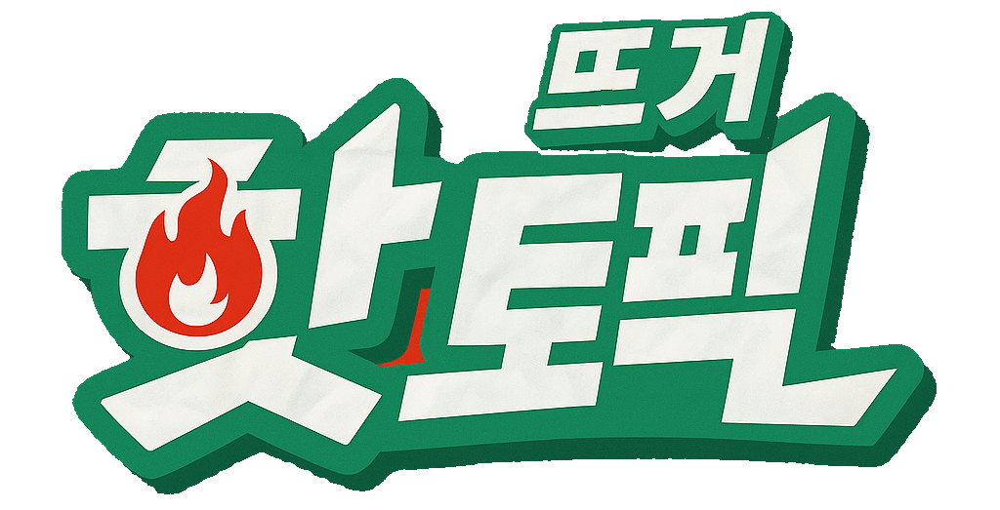

# 2025_CHALLKATHON_COM_GACK_FE
****HOTTOPIC.html****
<!DOCTYPE html>
<html>
    <head>
        <meta charset="UTF-8">
        <title>HOT! TOPIC</title>
        <link rel="stylesheet" href="Hot_style.css">
    </head>
    <body>
        

            <nav class="navibar" >
                

                    
                

                

                    

                        <ul>
                            <li>
                                <a href="#" class = "category">기간</a>
                                <ul class="dropdown-content">
                                    <li><a href="#" onclick="setPeriod('all')">최근 3년</a></li>
                                    <li><a href="#" onclick="setPeriod('2023')">2023년도</a></li>
                                    <li><a href="#" onclick="setPeriod('2024')">2024년도</a></li>
                                    <li><a href="#" onclick="setPeriod('2025')">2025년도</a></li>
                                </ul>
                            </li>
                            <li>
                                <a href="#"class = "category">분야</a>
                                <ul class="dropdown-content">
                                    <li><a href="#" onclick="setCategory('all')">전체</a></li>
                                    <li><a href="#" onclick="setCategory('technology')">기술</a></li>
                                    <li><a href="#" onclick="setCategory('science')">과학</a></li>
                                    <li><a href="#" onclick="setCategory('social')">사회</a></li>
                                    <li><a href="#" onclick="setCategory('health')">건강</a></li>
                                    <li><a href="#" onclick="setCategory('environment')">환경</a></li>
                                    <li><a href="#" onclick="setCategory('politics')">정치</a></li>
                                    <li><a href="#" onclick="setCategory('economy')">경제</a></li>
                                    <li><a href="#" onclick="setCategory('entertainment')">연예</a></li>
                                    <li><a href="#" onclick="setCategory('sports')">스포츠</a></li>
                                </ul>
                            </li>
                        </ul>
                    

                    

                        📅전체
                        🏷️전체
                    

                    <button id="toggle-flow-btn">재생</button>
                

            </nav>
        

        

            <h2 id="year-text">2025년 경과율</h2>
            

                

            

            

        

        

            

                
            
  
            

                
            

        

        

        

            
Made By COM-GACK

            

                <h3>연관 단어 세트</h3>
                <ul id="related-words-list"></ul>
            

            <a class="bottom-feedback-link" href="http://127.0.0.1:5500/HOT_email.html">Feed Back</a>
        

        
    </body>
</html>

****HOT_email.html****
<!DOCTYPE html>
<html>
<head>
<meta charset="UTF-8">
	<title>HOTTOPIC - feedback</title>
	<link rel="stylesheet" href="https://cdnjs.cloudflare.com/ajax/libs/font-awesome/6.5.0/css/all.min.css">
	
	<link rel="stylesheet" href="Hot_style.css">
</head>
<body>
	

	
Welcome To Your Feedback!! 

	

		
서비스에 대한 의견,개선 제안, 또는 다른 요청이 있으시다면 언제든지 아래 이메일로 알려주세요.  
		여러분의 소중한 피드백을 기다리고 있습니다!

		<i class="fa fa-envelope" aria-hidden="true"></i>
		  
				email  
				HUFS CES 22 김승민 -  <a href="mailto:legendman0509@gmail.com?subject=HOTTOPIC 피드백" class ="email-link">legendman0509@gmail.com</a> 
				HUFS CES 22 김태민 -  <a href="mailto:rlaxoals05@hufs.ac.kr?subject=HOTTOPIC 피드백" class ="email-link">rlaxoals05@hufs.ac.kr</a> 
				HUFS CES 22	노현두 -  <a href="mailto:rhdoo0410@naver.com?subject=HOTTOPIC 피드백" class ="email-link">rhdoo0410@naver.com</a> 
				HUFS CES 22 송경환 -  <a href="mailto:katdia93@hufs.ac.kr?subject=HOTTOPIC 피드백" class ="email-link"	>katdia93@hufs.ac.kr</a>
		
		

		<i class="fab fa-instagram"></i> instagram 	
		<a class="insta-link" href="https://www.instagram.com/seungmii1n/" target="_blank">김승민</a>
		<a class="insta-link" href="https://www.instagram.com/i_tam03/" target="_blank">김태민</a>
		<a class="insta-link" href="https://www.instagram.com/doo_roh/" target="_blank">노현두</a>
		<a class="insta-link" href="https://www.instagram.com/song_16hwan/" target="_blank">송경환</a>
		

		
	

	

		

			<a class = "back" href="http://127.0.0.1:5500/HOTTOPIC.html">BACK</a>
		

	
	

</body>
</html>

****Hot_style.css****
* {
    margin: 0;
    padding: 0;
    box-sizing: border-box;
    
}
body {
    color: white;
    overflow-y: auto;
    font-family: sans-serif;
    display : flex;
    flex-direction: column; 
    min-height : 100vh;
    background-image: linear-gradient(to right bottom,#F24E1E, #FCD34D);
}
/*main content page*/
#intro-screen {
    position: fixed;        
    left: 0;
    width: 100vw;
    height: 100vh;
    color: red;
    z-index: 99;          
    display: flex;
    flex-direction: column;
    align-items: center;
    justify-content: center;
    text-align: center;
    opacity: 1;
    transition: opacity 1s ease;
}

#progress-bar-container {
    width: 80%;
    height: 20px;
    background-color: #ddd;
    border-radius: 10px;
    margin: 20px auto;
    overflow: hidden;
    transition: opacity 1s ease;
}

#progress-bar {
    height: 100%;
    width: 0%;
    background-color: orange;
    border-radius: 10px;
    transition: width 0.5s ease;
}

#progress-percent-text {
    text-align: center;
    font-size: 18px;
    color: black;
    margin-top: 10px;
    transition: opacity 1s ease;
}

#word-flow-container {
    position: relative;
    width: 100%;
    height: 500px;
    overflow: hidden;
    margin: 0 auto;
    display:flex;
    justify-content: space-around;  
    flex-grow: 1;
}

.drop-target-left,
.drop-target-right {
    position: absolute;
    top: 0;
    width: 250px;
    height: 100%;
    color: white;
    font-weight: bold;
    text-align: center;
    writing-mode: vertical-rl;
    transform: rotate(180deg);
    font-size: 16px;
    cursor: pointer;
    padding: 10px 0;
    border: 2px dashed #fff;
    background: rgba(255, 255, 255, 0.1);
    transition: background-color 0.3s ease;
    z-index: 10;
}

.google-image {
    position: absolute;
    top: 50%;
    left: 50%;
    transform: translate(-50%, -50%);
    opacity: 0.5;
    width: 60px;  
    height: auto;
    pointer-events: none;
}

.naver-image {
    position: absolute;
    top: 50%;
    left: 50%;
    transform: translate(-50%, -50%);
    opacity: 0.5;
    width: 200px; 
    height: auto;
    pointer-events: none;
}

.drop-target-left {
    left:0;
}

.drop-target-right {
    right:0;
}

.drop-target-left:hover,
.drop-target-right:hover {
    background: rgba(255, 255, 255, 0.25);
}

#main-content {
    position: relative;
}
.word {
    position: absolute;
    white-space: nowrap;
    animation: drift 20s linear infinite;
    line-height: 1.2;
}

.word.paused {
    animation-play-state: paused !important;
}

@keyframes drift {
    0% {
        transform: translateX(100vw);
        opacity: 0;
    }
    5% {
        opacity: 1;
    }
    95% {
        opacity: 1;
    }
    100% {
        transform: translateX(-100vw);
        opacity: 0;
    }
}

/*내비게이션*/
.navibar {
    display: flex;
    align-items: center;
    padding:0 20px;
    background-color: #282828;
    height:66px;
}

.navibar-right {
    display: flex;
    align-items: center;
    gap: 30px;
}

.navibar-right a {
    display: block;
    padding: 20px 30px;
    color: white;
    text-decoration: none;
    background-color: #333;
}
.menu-items {
    overflow: visible;
}
.menu-items ul {
    margin-right: auto;
    display: flex;
    gap: 10px;
}
.menu-items ul ul {
    display: none;
    position: absolute;
    top: 100%;
    left: 0;
    background-color: #444;
    z-index: 10;
    min-width: 160px;
    flex-direction: column;
}
.menu-items li:hover > ul {
    display: flex;
}
.navibar ul {
    display: flex;
    list-style: none;
    margin: 0;
    padding: 0;
    overflow: visible;
}

.category {
    font-size: 18px;
}

.navibar li {
    position: relative;
}

.navibar a {
    display: block;
    padding: 16px 30px; 
    color: white;
    text-decoration: none;
    background-color: #333;
}

.navibar li:hover > a {
    background-color: #555;
}

#toggle-flow-btn {
    margin: 20px;
    padding: 6px 12px;
    font-size: 14px;
    cursor:pointer;
}
.filter-status {
    color: white;
    font-size: 14px;
    white-space: nowrap;
    margin: 20px;
    display: flex;
    gap: 10px;
}

.navibar_logo {
    width: 120px;
    cursor: pointer;
    margin-right: auto;
}

.navibar_logo img {
    width: 100%;
    height: auto;
}

.dropdown-content {
    display: none;
    position: absolute;
    top: 100%;
    left: 0;
    background-color: #444;
    z-index: 10;
    min-width: 160px;
    flex-direction: column;
}

.dropdown-content li {
    border-bottom: 1px solid #666;
}
.dropdown-content li:last-child {
    border-bottom: none;  
}

.dropdown-content a {
    background-color: #444;
    padding: 12px 16px;
    white-space: nowrap;
}

.dropdown-content a:hover {
    background-color: #5a5a5a;
}

.navibar li:hover > .dropdown-content {
    display: flex;
}

.bottom-container {
    display:flex;
    flex-direction: column;
    align-items: center;
    justify-content: space-between;
    position: relative;
    height: 120px;
    width: 100%;
    padding: 16px 32px;
    background: transparent;
}
.bottom-container > div,
.bottom-container > a {
  flex: 1;
  text-align: center;
}

.bottom-container .madeby {
  text-align: left;
}

.bottom-container .bottom-feedback-link {
  text-align: right;
}

#related-words-box {
    text-align: center;
}
#related-words-box h3 {
    margin: 0 0 5px 0;
    font-size: 18px;
}
#related-words-list {
  list-style: none;
  padding: 0;
  margin: 0;
  display: flex;
  gap: 10px;
  flex-wrap: wrap;
  justify-content: center;
}

#related-words-list li {
  background-color: rgba(255, 255, 255, 0.15);
  padding: 6px 12px;
  border-radius: 10px;
  font-weight: bold;
}
.madeby {
    position: absolute;
    margin: 40px;
    left: 30px;
    color: white;
    font-size: 24px;
}

.bottom-feedback-link {
    position: absolute;
    bottom: 50px;
    right: 70px;
    color: white;
    font-size: 24px;
    text-decoration: none;
}

/*feedback page*/

.feedback-container {
    background-image: linear-gradient(to right top,
    #d16ba5,#c777b9, #ba83ca, 
    #aa8fd8,#9a9ae1, #8aa7ec,
    #79b3f4, #69bff8, #52cffe, 
    #41dfff, #46eefa, #5ffbf1);

    min-height : 100vh;
}
.welcome {
    text-shadow: 2px 3px 0px #898999;
    font-weight: 900;
    font-size: 40px;
    font-family: sans-serif;
    margin:200px 0 0 250px;

}
.email-link > a {
    color : white;
    text-decoration: none;
}
.email-link > a:hover {
    color: #2FFFAD;
}
.introduce-container {
    font-size : 18px;
    margin : 50px 0 0 250px;

}

/*insta*/
.insta-link {
    padding : 30px;
    text-decoration: none;     
    color: white;
    margin: 0 8px;               
    transition: color 0.3s;     
}
.insta-link:hover {
    color: #ffd700;
}

.insta-container {
    margin-top:100px;
    margin-bottom: 25px;
}
.insta-gradient {
    font-weight: bold;
    background: linear-gradient(45deg, #feda75, #fa7e1e, 
    #d62976, #962fbf, #4f5bd5);
    -webkit-background-clip: text;
    -webkit-text-fill-color: transparent;
    display: inline-block;
}
.fa-envelope{
    margin-top:70px;
    
}
hr {
    border: none;
    border-top: 2px solid rgba(255, 255, 255, 0.44);
    display: block;
    width: 100%;
    background-blend-mode: overlay;
}
.bottom-feedback-container {
    height: auto;
    display : flex;
}
.back {
    color : white;
    text-decoration: none;
    margin: 40px 0 40px 50px;
    font-size: 24px;
}

****HOTscript.js****
let keywords = [];
let dataLoaded = false; // 데이터가 로딩되었는지 유무 판단

let selectedPeriod = "all"; //초기 기간,분야를 전체로 설정
let selectedCategory = "all";

const container = document.getElementById("word-flow-container");
const lines = 15;
let usedLines = new Set();
let currentFlowInterval = null;
let isPaused = false;
const wordTimestamps = new Map(); //단어가 정지된 시점 기록

function random(min, max) {
  return Math.random() * (max - min) + min;
}

//percentbar 관련 함수모음
// 연도의 경과율을 계산하는 함수
function getYearProgress() {
  const now = new Date(); // 현재 날짜와 시간 불러오기
  const start = new Date(now.getFullYear(),0,1); // 올해의 시작 (1월 1일)
  const end = new Date(now.getFullYear()+ 1,0,1); // 올해의 끝 = 내년 1월 1일
  const percent = ((now -start) /(end - start)) * 100; // 올해가 얼마나 지났는지 계산
  return percent.toFixed(2); // 소수점 둘째자리까지 반환
}
// 경과율을 보여주는 애니메이션 함수
function animateProgressBar(finalPercent) {
  const bar = document.getElementById("progress-bar"); // 경과율 바 요소
  const text = document.getElementById("progress-percent-text"); // 퍼센트 텍스트 요소
  let current = 0;
  const interval = setInterval(() => { // 40ms마다 0.5%씩 증가시켜 보여줌
    if (current >= finalPercent) { // 최근 퍼센트에 도달하면 정지
      clearInterval(interval);
    }
    else {
      current += 0.5;
      bar.style.width = `${current}%`; // 퍼센트만큼 바 길이 설정
      text.textContent =  `${new Date().getFullYear()}년은 ${current.toFixed(2)}% 지났습니다.`; //텍스트 표시
    }
  }, 40);
}

// word flow 관련 함수
function startWordFlow() {
  const filtered = getFilteredKeywords(); //선택된 기간과 분류에 맞게 필터링
  const lineHeight = container.offsetHeight / lines;
  let queue = [...filtered]; // 필터링된 단어들을 복사해서 큐 생성
  currentFlowInterval = setInterval(() => { // 0.25초 마다 단어 화면에 출력
    if (queue.length === 0) {
      queue = [...filtered]; //큐가 비면 다시 필터링된 단어들로 초기화
    }
    const next = queue.shift(); // 다음 단어 큐에서 가져오기
    spawnWord(next,lineHeight); // 단어 생성 함수 호출
  },250);
}
//flow 재시작함수
function restartWordFlow() {
  clearInterval(currentFlowInterval); // 기존 흐름 멈추기
  document.querySelectorAll(".word").forEach(el =>el.remove()); // 화면에 떠있는 단어들 제거
  startWordFlow(); // 새로운 flow 시작
}

//word-flow-container 설정
function getAvailableY(fontSize, lineHeight) {
  if (usedLines.size >= lines) usedLines.clear(); //usedLines : 현재 프레임에서 이미 사용된 라인 번호를 저장하는 Set
  let line;
  do { //아직 사용되지 않은 라인 랜덤으로 고르기
    line = Math.floor(Math.random() * lines);
  } while (usedLines.has(line));
  usedLines.add(line); //이미 사용된 라인이라면 다시 뽑기
  return line * lineHeight + (lineHeight - fontSize)/2; //선택된 라인에 맞춰서 y축 좌표 계산, +10으로 word가 상단에 붙지 않도록 함
}
function spawnWord(item, lineHeight) {
  const span = document.createElement("span"); //새로운 span 요소를 만들고 텍스트로 단어를 설정한 다음 word클래스 붙이기
  span.classList.add("word"); // 클래스 지정
  span.textContent = item.word; // 단어 텍스트 삽입

  // 크기 설정 (점수 기반)
  const fontSize = Math.min(item.score / 2 + 10,lineHeight-4); //word의 score에 맞춰 글씨 크기 설정 (lineheight보다는 작게)
  const y = getAvailableY(fontSize,lineHeight); //사용할 y축 좌표 계산
  const duration = 20000; // 숫자가 높을수록 느리다

  // 위치 설정
  span.style.top = y + "px"; // 수직 위치 지정
  span.style.fontSize = fontSize + "px"; // 글씨 크기 설정
  span.style.animation = `drift ${duration / 1000}s linear forwards`; // 왼쪽으로 이동하는 애니메이션
  span.style.animationPlayState = isPaused ? "paused" : "running"; // 정지 상태에 따라 애니메이션 제어

  const removeId = setTimeout(() => {
    if (span.parentElement) container.removeChild(span); // 일정 시간이 지나면 제거
  },duration);
  span.dataset.removeId = removeId; // 삭제 예약 ID 저장
  span.dataset.startTime = Date.now(); // 시작 시점 기록
  span.dataset.duration = duration; // 전체 애니메이션 시간 저장

  span.setAttribute("draggable","true"); // 드래그 가능 설정
  span.addEventListener("dragstart",e => {
    e.dataTransfer.setData("text/plain", item.word); // 드래그 시 단어 텍스트 전송
  });

  container.appendChild(span); //단어 화면에 추가하기
}

//필터링 함수 작성
function getFilteredKeywords() {
  return keywords.filter(item => {
    const matchPeriod = selectedPeriod === "all" || item.period === selectedPeriod;
    const matchCategory = selectedCategory === "all" || item.category === selectedCategory;
    return matchPeriod && matchCategory; // 필터링된 분류와 기간에 맞게 키워드 반환
  });
}
//선택 태그 반영 함수
function setPeriod(period) {
  selectedPeriod = period; // 선택한 기간으로 업데이트
  updateFilterStatus(); // 네비게이션에 현재 필터 상태 반영
  restartWordFlow(); // 필터 변경에 따라 재시작
}
function setCategory(category) {
  selectedCategory = category; // 선택한 카테고리로 업데이트
  updateFilterStatus(); // 네비게이션에 현재 필터 상태 반영
  restartWordFlow(); // 필터 변경에 따라 재시작
}
// 업데이트된 필터상태 표시
function updateFilterStatus() {
  const periodMap = {
    "all": "최근 3년",
    "2023": "2023년도",
    "2024": "2024년도",
    "2025": "2025년도",
  };
  const categoryMap = {
    "all": "전체",
    "technology": "기술",
    "science": "과학",
    "social": "사회",
    "health": "건강",
    "environment": "환경",
    "politics": "정치",
    "economy": "경제",
    "entertainment": "연예",
    "sports": "스포츠"
  };
  document.getElementById("filter-period").textContent = "📅 " + (periodMap[selectedPeriod] || "최근 3년"); // 선택된 기간 표시
  document.getElementById("filter-category").textContent = "🏷️ " + (categoryMap[selectedCategory] || "전체"); // 선택된 분류 표시
}

//정지, 재생 버튼
document.getElementById("toggle-flow-btn").addEventListener("click", () => {
  const button = document.getElementById("toggle-flow-btn");
  const words = document.querySelectorAll(".word");

  if (!isPaused) {
    words.forEach(word => {
      word.style.animationPlayState = "paused"; //css 애니메이션 멈춤
      clearTimeout(word.dataset.removeId); // 제거 예약 취소
      const elapsed = Date.now() - word.dataset.startTime; // 경과 시간 계산
      word.dataset.remaining = word.dataset.duration - elapsed; // 남은 시간 저장
    });
    clearInterval(currentFlowInterval); // 단어 생성 멈춤
    currentFlowInterval = null;
    button.textContent = "재생" // 버튼 텍스트 변경
    isPaused = true; // 상태 변경
  } else {
    words.forEach(word => {
      word.style.animationPlayState = "running"; // 애니메이션 재개
      const remaining = word.dataset.remaining || word.dataset.duration;
      const newId = setTimeout(() => {
        if (word.parentElement) container.removeChild(word);
      }, remaining); // 남은 시간 뒤에 제거 예약
      word.dataset.removeId = newId;
      word.dataset.startTime = Date.now();
      word.dataset.duration = remaining;
    });
    startWordFlow(); // 단어 생성 다시 시작
    button.textContent = "정지"; // 버튼 텍스트 변경
    isPaused = false; // 상태 변경
  }
});

// 드롭 타켓 이벤트
document.addEventListener('DOMContentLoaded', function () {
  const leftBox = document.querySelector('.drop-target-left');
  const rightBox = document.querySelector('.drop-target-right');

  function setupSearchDropEvent(target, searchBaseUrl) {
    target.addEventListener('dragover', e => e.preventDefault()); // 드롭 허용

    target.addEventListener('drop', e => {
      e.preventDefault();
      const keyword = e.dataTransfer.getData("text/plain"); // 드래그된 단어 가져오기
      if (keyword) {
        const encoded = encodeURIComponent(keyword);
        const fullUrl = `${searchBaseUrl}${encoded}`; // 검색 URL 생성
        window.open(fullUrl, '_blank'); // 새 창으로 검색
      }
    });
  }
  setupSearchDropEvent(leftBox, 'https://search.naver.com/search.naver?query='); // 왼쪽 → 네이버 검색
  setupSearchDropEvent(rightBox, 'https://www.google.com/search?q='); // 오른쪽 → 구글 검색
})

fetch("Hotwords.json") //json 파일 받아와서 keywords에 데이터 넣기, 로딩됬으면 true로 변경
  .then(response => response.json())
  .then(data => {
    keywords = data;
    dataLoaded = true;
  })
  .catch(error => console.error("키워드 JSON 로드 실패:",error));

document.addEventListener("DOMContentLoaded", () => {
  // 요소 참조
  const intro = document.getElementById("intro-screen"); // 인트로 화면
  const main = document.getElementById("main-content"); // 메인 콘텐츠
  const bottom = document.querySelector(".bottom-container"); // 하단 부분

  // 초기 상태 숨기기
  main.style.display = "block";
  bottom.style.display = "flex";

  // 연도 진행률 애니메이션 시작
  const final = getYearProgress();
  animateProgressBar(final);

  // 6초 후 인트로 종료 및 메인 진입
  setTimeout(() => {
    // intro → main 전환
    document.getElementById("intro-screen").style.display = "none";
    document.getElementById("main-content").style.display = "block";
    document.getElementsByClassName("bottom-container")[0].style.display = "block";
    isPaused = false;
    document.getElementById("toggle-flow-btn").textContent = "정지"
    const waitForData = setInterval(() => {
      if (dataLoaded) {
        clearInterval(waitForData);
        updateFilterStatus();
        restartWordFlow();
      }
    },100);
  }, 6000);
});

let relatedKeywordGroups =[]; //연관단어세트
let relatedInterval = null;
let relatedIndex = 0;

fetch("연관단어점수0625_2200.json") //연관단어세트 json 파일 불러오기
  .then(res => res.json())
  .then(data => {
    relatedKeywordGroups = data; // data 불러와서 저장
    startRelatedWordsRotation(); // 자동 순환 시작
  })
  .catch(err => console.error("연관 단어 JSON 로드 실패:", error));

function startRelatedWordsRotation() { // 연관 키워드 데이터가 없으면 함수 종료
  if (!relatedKeywordGroups.length) return;

  const list = document.getElementById("related-words-list"); // 연관 단어 목록을 표시할 <ul> 요소

  const update = () => { // 연관 단어 목록 갱신
    const group = relatedKeywordGroups[relatedIndex]; // 현재 인덱스에 해당하는 연관 단어 세트 가져오기
    list.innerHTML = ""; // 기존 목록 초기화

    for (let i = 1; i <= 5; i++) { // 1~5번까지 연관 단어와 점수를 표시
      const word = group[`연관단어${i}`];
      const score = group[`점수${i}`];
      if (word) {
        const li = document.createElement("li"); // 새로운 요소 생성
        li.textContent = `${word} (${score})`;
        list.appendChild(li); 
      }
    }

    relatedIndex = (relatedIndex + 1) % relatedKeywordGroups.length; //다음에 보여줄 인덱스 순환
  };

  update(); // 초기 표시
  relatedInterval = setInterval(update, 3000); // 이후 반복
}

****Hotwords.json****
[
    {"word":"더글로리","score":90,"period":"2023","category":"entertainment"},
    {"word":"무빙","score":90,"period":"2023","category":"entertainment"},
    {"word":"마스크걸","score":80,"period":"2023","category":"entertainment"},
    {"word":"뉴진스","score":90,"period":"2023","category":"entertainment"},
    {"word":"서울의봄","score":100,"period":"2023","category":"entertainment"},
    {"word":"OMG","score":70,"period":"2023","category":"entertainment"},
    {"word":"ETA","score":80,"period":"2023","category":"entertainment"},
    {"word":"전청조","score":100,"period":"2023","category":"social"},
    {"word":"문빈","score":60,"period":"2023","category":"health"},
    {"word":"이스라엘","score":100,"period":"2023","category":"politics"},
    {"word":"가자","score":100,"period":"2023","category":"politics"},
    {"word":"OpenAI","score":60,"period":"2023","category":"technology"},
    {"word":"튀르키예","score":50,"period":"2023","category":"politics"},
    {"word":"월드컵","score":50,"period":"2023","category":"sports"},
    {"word":"항저우","score":100,"period":"2023","category":"sports"},
    {"word":"아시안게임","score":70,"period":"2023","category":"sports"},
    {"word":"장마","score":100,"period":"2023","category":"environment"},
    {"word":"홍수","score":100,"period":"2023","category":"environment"},
    {"word":"알파세대","score":50,"period":"2023","category":"social"},
    {"word":"팝업스토어","score":60,"period":"2023","category":"social"},
    {"word":"숏폼","score":50,"period":"2023","category":"social"},
    {"word":"쇼츠","score":50,"period":"2023","category":"social"},
    {"word":"스즈메의문단속","score":40,"period":"2023","category":"entertainment"},
    {"word":"엘리멘탈","score":40,"period":"2023","category":"entertainment"},
    {"word":"LCK","score":60,"period":"2023","category":"entertainment"},
    {"word":"타이타닉","score":70,"period":"2023","category":"social"},
    {"word":"잠수함","score":70,"period":"2023","category":"science"},
    {"word":"서현역","score":70,"period":"2023","category":"social"},
    {"word":"카눈","score":60,"period":"2023","category":"environment"},
    {"word":"잼버리","score":100,"period":"2023","category":"social"},
    {"word":"핵무장","score":80,"period":"2023","category":"politics"},
    {"word":"중동","score":80,"period":"2023","category":"politics"},
    {"word":"후쿠시마","score":80,"period":"2023","category":"environment"},
    {"word":"오염수","score":90,"period":"2023","category":"environment"},
    {"word":"이태원","score":60,"period":"2023","category":"social"},
    {"word":"새만금","score":40,"period":"2023","category":"environment"},
    {"word": "신석호", "score": 100, "period": "2024", "category": "politics"},
    {"word": "대통령", "score": 86, "period": "2024", "category": "politics"},
    {"word": "economy", "score": 79, "period": "2024", "category": "economy"},
    {"word": "재난", "score": 51, "period": "2024", "category": "politics"},
    {"word": "서울특별시", "score": 49, "period": "2024", "category": "social"},
    {"word": "의원", "score": 44, "period": "2024", "category": "politics"},
    {"word": "교육", "score": 44, "period": "2024", "category": "politics"},
    {"word": "사업", "score": 38, "period": "2024", "category": "politics"},
    {"word": "특검", "score": 37, "period": "2024", "category": "politics"},
    {"word": "조사", "score": 33, "period": "2024", "category": "technology"},
    {"word": "대표", "score": 31, "period": "2024", "category": "economy"},
    {"word": "서울", "score": 28, "period": "2024", "category": "social"},
    {"word": "사회", "score": 24, "period": "2024", "category": "social"},
    {"word": "청소년", "score": 21, "period": "2024", "category": "politics"},
    {"word": "응원", "score": 19, "period": "2024", "category": "politics"},
    {"word": "정책", "score": 17, "period": "2024", "category": "politics"},
    {"word": "이용", "score": 12, "period": "2024", "category": "technology"},
    {"word": "전국", "score": 12, "period": "2024", "category": "entertainment"},
    {"word": "이상", "score": 11, "period": "2024", "category": "politics"},
    {"word": "관련", "score": 11, "period": "2024", "category": "politics"},
    {"word": "스페셜", "score": 11, "period": "2024", "category": "politics"},
    {"word": "무릎", "score": 10, "period": "2024", "category": "politics"},
    {"word": "악수", "score": 10, "period": "2024", "category": "politics"},
    {"word": "치료", "score": 9, "period": "2024", "category": "health"},
    {"word": "이번", "score": 8, "period": "2024", "category": "politics"},
    {"word": "계획", "score": 8, "period": "2024", "category": "politics"},
    {"word": "빌딩", "score": 8, "period": "2024", "category": "politics"},
    {"word": "정부", "score": 6, "period": "2024", "category": "politics"},
    {"word": "신문", "score": 6, "period": "2024", "category": "politics"},
    {"word": "협동조합", "score": 6, "period": "2024", "category": "politics"},
    {"word": "홍기", "score": 6, "period": "2024", "category": "politics"},
    {"word": "개인정보", "score": 6, "period": "2024", "category": "politics"},
    {"word": "후원", "score": 6, "period": "2024", "category": "politics"},
    {"word": "지급", "score": 5, "period": "2024", "category": "politics"},
    {"word": "사용", "score": 4, "period": "2024", "category": "technology"},
    {"word": "기업", "score": 4, "period": "2024", "category": "politics"},
    {"word": "시", "score": 4, "period": "2024", "category": "politics"},
    {"word": "글자", "score": 4, "period": "2024", "category": "politics"},
    {"word": "이재명", "score": 4, "period": "2024", "category": "politics"},
    {"word": "설정", "score": 4, "period": "2024", "category": "technology"},
    {"word": "지원", "score": 2, "period": "2024", "category": "politics"},
    {"word": "연설", "score": 2, "period": "2024", "category": "politics"},
    {"word": "시설", "score": 1, "period": "2024", "category": "politics"},
    {"word": "금지", "score": 1, "period": "2024", "category": "politics"},
    {"word": "게시", "score": 1, "period": "2024", "category": "social"},
    {"word": "검색어", "score": 1, "period": "2024", "category": "social"},
    {"word": "산업", "score": 1, "period": "2024", "category": "politics"},
    {"word": "수집", "score": 1, "period": "2024", "category": "technology"},
    {"word": "교", "score": 0, "period": "2024", "category": "politics"},
    {"word": "상품권", "score": 0, "period": "2024", "category": "politics"},
    {"word":"출석","score":22,"period":"2025","category":"social"},
    {"word":"특검","score":19,"period":"2025","category":"politics"},
    {"word":"내란","score":75,"period":"2025","category":"social"},
    {"word":"대통령","score":90,"period":"2025","category":"politics"},
    {"word":"형소법","score":45,"period":"2025","category":"politics"},
    {"word":"재난","score":47,"period":"2025","category":"social"},
    {"word":"산업","score":19,"period":"2025","category":"economy"},
    {"word":"정부","score":22,"period":"2025","category":"politics"},
    {"word":"황새","score":21,"period":"2025","category":"social"},
    {"word":"정책","score":23,"period":"2025","category":"politics"},
    {"word":"빌딩","score":19,"period":"2025","category":"social"},
    {"word":"협동조합","score":27,"period":"2025","category":"social"},
    {"word":"이재명","score":35,"period":"2025","category":"social"},
    {"word":"기획","score":25,"period":"2025","category":"social"},
    {"word":"치료","score":25,"period":"2025","category":"social"},
    {"word":"조사","score":39,"period":"2025","category":"social"},
    {"word":"문화","score":24,"period":"2025","category":"social"},
    {"word":"전북","score":26,"period":"2025","category":"social"},
    {"word":"최종","score":23,"period":"2025","category":"social"},
    {"word":"차관","score":22,"period":"2025","category":"social"},
    {"word":"대표","score":25,"period":"2025","category":"social"},
    {"word":"향후","score":21,"period":"2025","category":"social"},
    {"word":"서울","score":16,"period":"2025","category":"social"},
    {"word":"지역","score":26,"period":"2025","category":"social"},
    {"word":"회부","score":20,"period":"2025","category":"social"},
    {"word":"전남","score":22,"period":"2025","category":"social"},
    {"word":"재혼","score":19,"period":"2025","category":"social"},
    {"word":"인공","score":19,"period":"2025","category":"social"},
    {"word":"세계","score":24,"period":"2025","category":"social"},
    {"word":"이상","score":19,"period":"2025","category":"social"},
    {"word":"성장","score":19,"period":"2025","category":"social"},
    {"word":"수소","score":18,"period":"2025","category":"social"},
    {"word":"국회","score":22,"period":"2025","category":"politics"},
    {"word":"인권위","score":18,"period":"2025","category":"social"},
    {"word":"위원장","score":18,"period":"2025","category":"social"},
    {"word":"아이","score":20,"period":"2025","category":"social"},
    {"word":"창업","score":18,"period":"2025","category":"social"},
    {"word":"추진","score":18,"period":"2025","category":"social"},
    {"word":"사회","score":18,"period":"2025","category":"social"},
    {"word":"결제","score":18,"period":"2025","category":"social"},
    {"word":"피해","score":19,"period":"2025","category":"social"},
    {"word":"대한","score":30,"period":"2025","category":"social"},
    {"word":"강남","score":21,"period":"2025","category":"social"},
    {"word":"중이","score":17,"period":"2025","category":"social"},
    {"word":"수온","score":17,"period":"2025","category":"social"},
    {"word":"국방","score":27,"period":"2025","category":"social"},
    {"word":"이란","score":36,"period":"2025","category":"social"},
    {"word":"가장","score":21,"period":"2025","category":"social"},
    {"word":"광주","score":32,"period":"2025","category":"social"},
    {"word":"악수","score":17,"period":"2025","category":"social"},
    {"word":"부안군","score":16,"period":"2025","category":"social"},
    {"word":"취재","score":18,"period":"2025","category":"social"},
    {"word":"생산","score":16,"period":"2025","category":"economy"},
    {"word":"기술","score":16,"period":"2025","category":"economy"},
    {"word":"병원","score":16,"period":"2025","category":"social"},
    {"word":"대응","score":17,"period":"2025","category":"social"},
    {"word":"윤석열","score":35,"period":"2025","category":"politics"},
    {"word":"철강","score":16,"period":"2025","category":"social"},
    {"word":"배구","score":15,"period":"2025","category":"social"},
    {"word":"감사원","score":15,"period":"2025","category":"social"},
    {"word":"보호","score":15,"period":"2025","category":"social"},
    {"word":"인천","score":15,"period":"2025","category":"social"},
    {"word":"기준","score":17,"period":"2025","category":"social"},
    {"word":"국가","score":17,"period":"2025","category":"social"},
    {"word":"윤","score":52,"period":"2025","category":"social"},
    {"word":"전략","score":21,"period":"2025","category":"social"},
    {"word":"지연","score":21,"period":"2025","category":"social"},
    {"word":"진행","score":16,"period":"2025","category":"social"},
    {"word":"미국","score":26,"period":"2025","category":"social"},
    {"word":"인사","score":15,"period":"2025","category":"social"},
    {"word":"시장","score":16,"period":"2025","category":"social"},
    {"word":"이야기","score":17,"period":"2025","category":"social"},
    {"word":"청소년","score":17,"period":"2025","category":"social"},
    {"word":"상황","score":15,"period":"2025","category":"social"},
    {"word":"핵","score":23,"period":"2025","category":"social"},
    {"word":"지난해","score":18,"period":"2025","category":"social"},
    {"word":"구속","score":29,"period":"2025","category":"politics"},
    {"word":"공습","score":15,"period":"2025","category":"social"},
    {"word":"시민","score":18,"period":"2025","category":"social"},
    {"word":"소환","score":36,"period":"2025","category":"politics"},
    {"word":"트럼프","score":23,"period":"2025","category":"social"},
    {"word":"국민","score":15,"period":"2025","category":"social"},
    {"word":"평가","score":23,"period":"2025","category":"social"},
    {"word":"법원","score":31,"period":"2025","category":"politics"},
    {"word":"확보","score":27,"period":"2025","category":"social"},
    {"word":"경우","score":16,"period":"2025","category":"social"},
    {"word":"비","score":21,"period":"2025","category":"social"},
    {"word":"체포영장","score":45,"period":"2025","category":"social"},
    {"word":"이전","score":15,"period":"2025","category":"social"},
    {"word":"기각","score":100,"period":"2025","category":"politics"},
    {"word":"의심","score":16,"period":"2025","category":"social"},
    {"word":"청구","score":30,"period":"2025","category":"politics"},
    {"word":"통보","score":21,"period":"2025","category":"social"},
    {"word":"김용현","score":62,"period":"2025","category":"social"},
    {"word":"측은","score":19,"period":"2025","category":"social"},
    {"word":"랄랄","score":93,"period":"2025","category":"entertainment"},
    {"word":"외환","score":21,"period":"2025","category":"economy"},
    {"word":"신병","score":19,"period":"2025","category":"social"},
    {"word":"근로장려금","score":46,"period":"2025","category":"economy"},
    {"word":"도르트문트 대 울산","score":92,"period":"2025","category":"sports"},
    {"word":"인테르 대 리버 플레이트","score":46,"period":"2025","category":"sports"},
    {"word":"gemini cli","score":92,"period":"2025","category":"technology"},
    {"word":"마지 심슨","score":46,"period":"2025","category":"entertainment"},
    {"word":"부천국제판타스틱영화제","score":46,"period":"2025","category":"entertainment"},
    {"word":"심은경","score":46,"period":"2025","category":"entertainment"},
    {"word":"nba draft","score":46,"period":"2025","category":"sports"},
    {"word":"뇌르고르","score":92,"period":"2025","category":"sports"},
    {"word":"inter vs river plate","score":46,"period":"2025","category":"sports"},
    {"word":"엔비디아","score":92,"period":"2025","category":"economy"},
    {"word":"26기 광수","score":46,"period":"2025","category":"social"},
    {"word":"지하철 방화","score":92,"period":"2025","category":"social"},
    {"word":"토스 행운퀴즈 정답","score":46,"period":"2025","category":"entertainment"},
    {"word":"제주항공","score":46,"period":"2025","category":"economy"},
    {"word":"테슬라","score":46,"period":"2025","category":"economy"}
]
